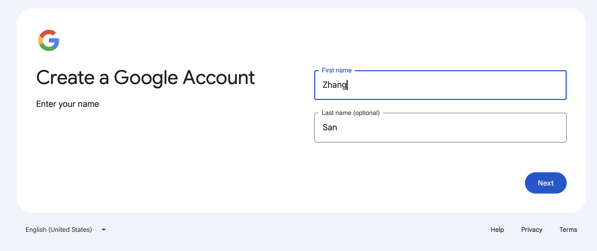
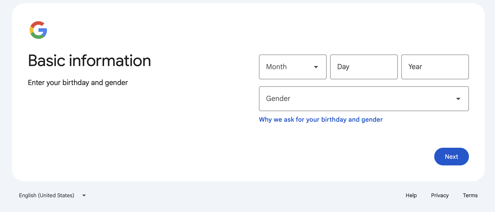
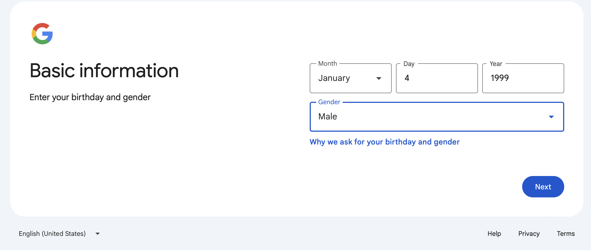
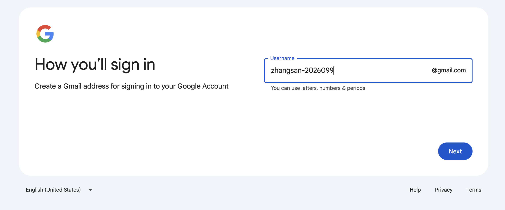
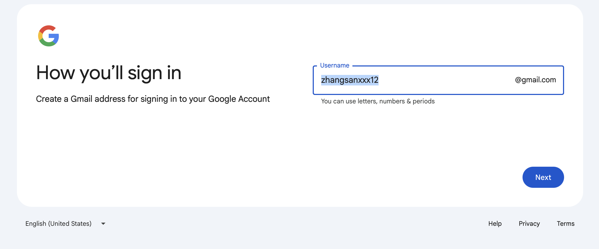
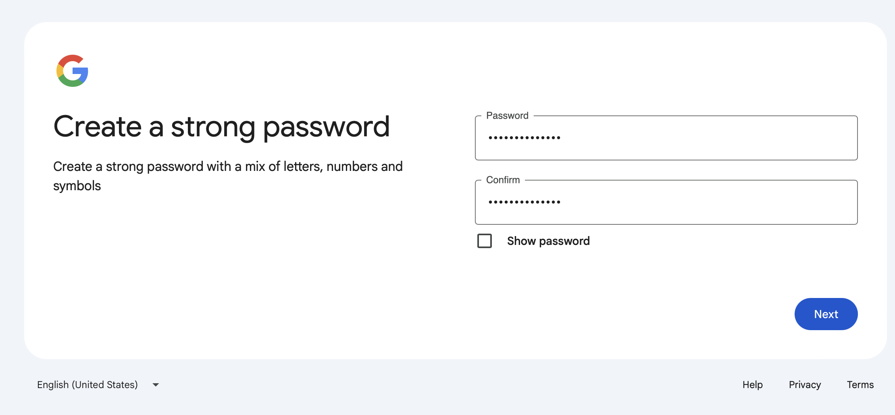
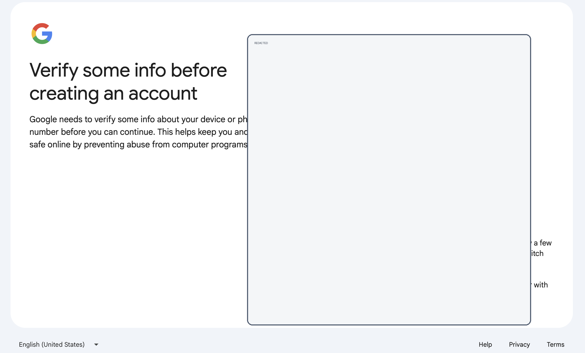

# 国内ChatGPT 账号注册、Plus 升级与 Codex 使用环境搭建（mac版 手把手步骤）

> 适用对象：第一次使用 ChatGPT 和 Codex 的同学  
> 更新时间：2026-05-10  
> 维护人：填写维护人姓名  
> 官方参考：  
> - ChatGPT 入口：https://chatgpt.com/  
> - ChatGPT 价格页：https://openai.com/chatgpt/pricing/  
> - ChatGPT Plus 帮助：https://help.openai.com/en/articles/6950777-what-is-chatgpt-plus  
> - Codex 套餐说明：https://help.openai.com/en/articles/11369540-using-codex-with-your-chatgpt-plan  
> - Codex CLI 文档：https://developers.openai.com/codex/cli

## 1. 文档目标

本文用于说明：

- 如何注册 ChatGPT 账号。
- 如何升级到 ChatGPT Plus 会员。
- 如何准备本地 Codex 使用环境。
- 如何完成 Codex 登录和第一次使用。
- 如何处理常见问题。

本文不包含：

- 账号共享、代充或绕过限制的操作。
- 非官方客户端或未知来源安装包。
- 违反 OpenAI 服务条款的使用方式。

## 2. 准备工作

### 2.1 设备和浏览器

建议准备：

- 一台可正常联网的电脑。（需要科学上网🐶）
- 最新版本的 Chrome、Edge、Safari 或 Firefox。
- 一个可正常收信的邮箱。（没有也没事，我会教你如何注册Google邮箱）
- 可用于支付订阅的付款方式。

截图占位：

```text
[截图：浏览器打开 chatgpt.com 首页]
```

### 2.2 Google邮箱注册

科学上网务必选取美国站点，这样就不要验证手机号，务必注意⚠️⚠️⚠️：

流程截图如下：















## 3. 注册 ChatGPT 账号

### 3.1 打开 ChatGPT

1. 打开浏览器。
2. 访问：https://chatgpt.com/
3. 点击登录或注册入口。

截图占位：

```text
[截图：ChatGPT 首页登录/注册入口]
```

### 3.2 创建账号

可选方式：

- 使用邮箱注册。
- 使用 Google 账号登录。
- 使用 Microsoft 账号登录。
- 使用 Apple 账号登录。

填写说明：

| 项目 | 说明 |
| --- | --- |
| 邮箱 | 建议使用长期可访问的个人或公司邮箱 |
| 密码 | 建议使用高强度密码，并保存到密码管理器 |
| 验证邮件 | 按页面提示打开邮箱完成验证 |
| 登录方式 | 后续登录时要使用同一种方式，避免误进另一个账号 |

截图占位：

```text
[截图：邮箱验证页面]
```

### 3.3 首次登录检查

登录后建议确认：

- 左下角或账号菜单显示的是自己的账号。
- 能够正常新建对话。
- 能够在设置中找到账号、数据控制和订阅相关入口。

记录：

```text
账号邮箱：
注册日期：
登录方式：
```

## 4. 升级 ChatGPT Plus

### 4.1 升级前确认

升级前先确认：

- 当前登录的是正确账号。
- 已了解 Plus 的当前价格和权益，以官方价格页为准。
- 已准备好可用的付款方式。
- 如果是团队或公司使用，先确认是否应使用 Business、Enterprise 或 Edu 计划。

官方页面：

```text
https://openai.com/chatgpt/pricing/
```

### 4.2 从网页端升级

常见路径：

1. 登录 ChatGPT。
2. 打开账号菜单。
3. 选择升级计划或 Upgrade Plan。
4. 选择 Plus。
5. 按页面提示完成支付。

截图占位：

```text
[截图：账号菜单中的 Upgrade Plan]
[截图：Plus 计划选择页面]
[截图：支付确认页面，注意遮挡隐私信息]
```

### 4.3 升级后验证

升级完成后检查：

- 账号菜单或设置中显示当前计划为 Plus。
- 能看到 Plus 对应的可用功能或更高使用额度。
- 发票、订阅管理和取消入口可以正常打开。

记录：

```text
升级日期：
订阅计划：
付款方式后四位，选填：
发票下载位置：
```

### 4.4 注意事项

- Plus 是 ChatGPT 订阅，不等同于 API 免费额度。
- API 用量通常需要单独配置和计费。
- 价格、功能、额度可能变化，写正式教程前请重新检查官方页面。
- 如果扣款成功但账号仍显示免费版，先确认是否登录了同一个账号和同一种登录方式。

## 5. Codex 使用方式概览

Codex 是 OpenAI 的编码智能体，可以帮助阅读代码、修改文件、运行测试、解释项目和处理开发任务。

常见入口：

| 入口 | 适合场景 | 备注 |
| --- | --- | --- |
| Codex App | 桌面端协作和本地项目开发 | 适合日常开发 |
| Codex CLI | 在终端里使用 Codex | 适合开发者和脚本化工作流 |
| IDE 扩展 | 在编辑器里调用 Codex | 适合边写代码边协作 |
| Codex Web | 云端委托任务 | 通常需要连接 GitHub 仓库 |

截图占位：

```text
[截图：Codex 入口或客户端选择页面]
```

## 6. 搭建 Codex CLI 使用环境

### 6.1 安装前检查

运行：

```bash
node -v
npm -v
git --version
```

如果没有安装 Node.js：

```text
前往 Node.js 官网下载安装包，或使用公司内部推荐的软件安装方式。
```

如果没有安装 Git：

```text
前往 Git 官网下载安装包，或使用系统自带开发者工具安装。
```

### 6.2 安装 Codex CLI

官方帮助文档中的安装方式示例：

```bash
npm i -g @openai/codex
```

安装后检查：

```bash
codex --version
```

截图占位：

```text
[截图：终端显示 codex 版本号]
```

### 6.3 启动并登录 Codex

安装完成后，在终端运行：

```bash
codex
```

首次运行时，Codex 会提示登录。按页面提示：

1. 在浏览器中打开登录页面。
2. 使用 ChatGPT 账号或 API Key 完成认证。
3. 使用自己的 ChatGPT 账号登录。
4. 回到终端确认登录完成。

截图占位：

```text
[截图：Codex CLI 登录提示]
[截图：ChatGPT 认证页面]
[截图：终端登录成功提示]
```

### 6.4 进入项目目录

建议在 Git 仓库中使用 Codex：

```bash
cd 你的项目目录
git status
codex
```

说明：

- `git status` 用于确认当前项目是否是 Git 仓库，以及是否存在未提交修改。
- 第一次使用 Codex 时，建议选择较保守的权限模式，先让它读取项目、解释代码、提出修改建议。
- 在让 Codex 自动修改或运行命令前，先确认项目中没有重要的未备份内容。

## 7. Codex 简单使用示例

### 7.1 让 Codex 解释项目

可输入：

```text
请阅读这个项目，帮我总结项目结构、启动方式和主要功能。
```

期望输出：

```text
Codex 会查看项目文件，并给出目录结构、技术栈、关键入口文件和运行建议。
```

### 7.2 让 Codex 修复问题

可输入：

```text
这个项目启动时报错，请帮我定位原因并修复。修复后请运行相关检查。
```

建议补充：

```text
报错信息：
复现步骤：
期望行为：
实际行为：
```

### 7.3 让 Codex 添加小功能

可输入：

```text
请给首页增加一个常见问题区域，风格保持和现有页面一致。完成后请检查移动端布局。
```

验收清单：

- 页面能正常打开。
- 样式和现有设计一致。
- 手机和桌面端都不重叠。
- 没有无关文件被修改。

### 7.4 让 Codex 做代码审查

可输入：

```text
请 review 当前改动，重点检查潜在 bug、边界情况、回归风险和缺失测试。
```

期望输出：

```text
Codex 应优先列出问题、影响范围和建议修复方式，而不是只做概括。
```

## 8. 常见问题

### 8.1 注册后收不到验证邮件

排查步骤：

1. 检查垃圾邮件。
2. 确认邮箱地址是否拼写正确。
3. 等待几分钟后重新发送验证邮件。
4. 更换网络或浏览器重试。

### 8.2 升级 Plus 后没有生效

排查步骤：

1. 确认是否登录了购买 Plus 的同一个账号。
2. 确认是否使用了相同登录方式，例如邮箱、Google、Apple 或 Microsoft。
3. 退出所有设备后重新登录。
4. 在移动端购买的订阅，按应用内提示恢复购买。
5. 仍未解决时联系 OpenAI 支持，并准备付款凭证。

### 8.3 `npm i -g @openai/codex` 失败

排查步骤：

1. 检查 Node.js 和 npm 是否已安装。
2. 检查当前网络是否能访问 npm registry。
3. 检查是否有权限安装全局 npm 包。
4. 如果是公司电脑，确认是否需要使用公司代理或内部软件源。

记录错误：

```text
错误命令：
错误截图：
操作系统：
Node.js 版本：
npm 版本：
```

### 8.4 首次运行 `codex` 时登录失败

排查步骤：

1. 确认浏览器中登录的是正确 ChatGPT 账号。
2. 关闭浏览器隐私模式后重试。
3. 更新 Codex CLI 到最新版本。
4. 清理旧登录状态后重新登录。

可记录：

```text
错误提示：
发生时间：
是否使用代理：
是否公司网络：
```

### 8.5 Codex 修改代码前要注意什么

建议：

- 先确认项目已纳入 Git 管理。
- 修改前运行 `git status`。
- 不要在有重要未保存内容时让 Codex 自动大范围修改。
- 让 Codex 修改后运行测试或启动检查。
- 提交前人工 review 关键改动。

## 9. 推荐新手练习

### 练习 1：解释一个项目

目标：

```text
让 Codex 读项目，不做修改，只输出项目结构和启动方式。
```

提示词：

```text
请只阅读项目，不修改文件。帮我总结这个项目的目录结构、主要入口、启动方式和注意事项。
```

### 练习 2：修复一个文案问题

目标：

```text
让 Codex 做一次小范围修改，熟悉确认流程。
```

提示词：

```text
请把首页中不自然的中文文案润色一下，保持意思不变。完成后告诉我改了哪些文件。
```

### 练习 3：添加一个简单页面

目标：

```text
让 Codex 完成一个低风险功能。
```

提示词：

```text
请新增一个关于页面，内容包括个人介绍、技能方向和联系方式。风格保持和现有网站一致。
```

## 10. 安全和合规提醒

- 不要把账号密码、支付信息、验证码发给任何人。
- 不要把私有 API Key、数据库密码、生产密钥粘贴到公开对话或公开仓库。
- 处理公司代码前，先确认公司是否允许使用相关工具。
- 生成内容、代码和配置上线前必须人工检查。
- 涉及隐私、合规、生产数据的任务，必须按公司规范处理。

## 11. 维护记录

| 日期 | 修改人 | 修改内容 | 参考来源 |
| --- | --- | --- | --- |
| 2026-05-10 | 填写姓名 | 创建初版模板 | OpenAI 官方帮助中心和价格页 |

## 12. 待补充清单

- [ ] 补充实际注册流程截图。
- [ ] 补充 Plus 升级流程截图。
- [ ] 补充不同系统的 Node.js 安装方式。
- [ ] 补充 macOS、Windows、Linux 的 Codex CLI 安装差异。
- [ ] 补充公司内部网络或代理配置说明。
- [ ] 补充常见报错截图和解决方案。
- [ ] 补充一套完整的新手演示案例。
